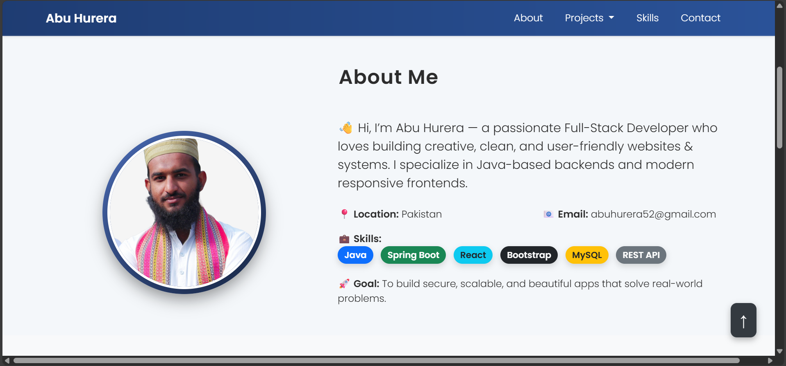

# 💼 Abu Hurera's Portfolio

Welcome to my personal developer portfolio!  
This website showcases my projects, skills, and a bit about who I am as a developer.

---

## 🔗 Live Demo

🌐 [View Portfolio](https://velvety-raindrop-68e2ba.netlify.app/)  

📁 [GitHub Repository](https://github.com/AbuHurera05/PortFolio)

---

## 📸 Screenshots

---

# 💫 About Me:
Hi, I'm **Abu Hurera** 🇵🇰   💻 Passionate Software Developer from Pakistan    I specialize in building **clean, scalable, and user-focused web applications** using modern technologies. I enjoy transforming ideas into elegant and efficient digital solutions while continuously learning and improving my skills.  🚀 **Key Interests:** - Web Development (Frontend & Backend) - Software Architecture & Problem Solving - Learning New Technologies & Frameworks  🎯 **Goal:**   To develop high-quality applications that deliver seamless user experiences and real-world impact.

## 🌐 Socials:
   

# 💻 Tech Stack:
                                     
# 📊 GitHub Stats:
 
 

---

<!-- Proudly created with GPRM ( https://gprm.itsvg.in ) -->
